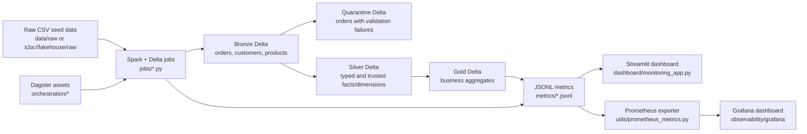
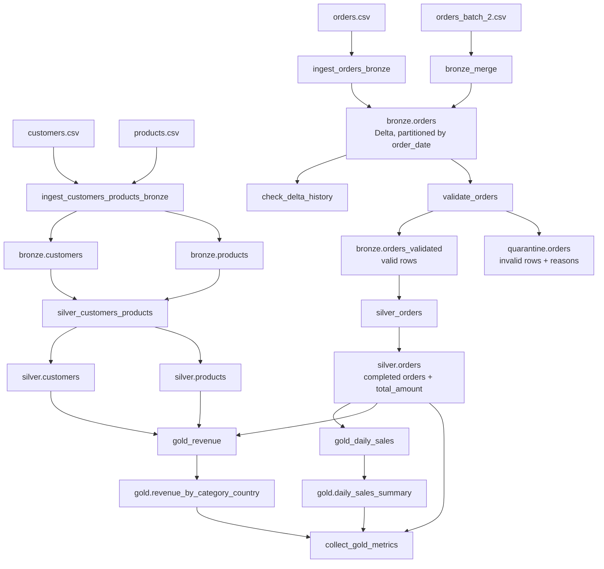

# Architecture

This project is a local ecommerce lakehouse built with Spark, Delta Lake, Docker,
Dagster, Streamlit, Prometheus, and Grafana. The pipeline follows the standard
bronze, silver, gold pattern and adds quarantine, metrics, and dashboarding so
pipeline health is visible alongside business outputs.

## System Architecture

## Data Flow

## Runtime Modes

| Mode | Config | Storage | How to run |
| --- | --- | --- | --- |
| Local dev | `configs/dev.yaml` | `data/*` local Delta paths | `make pipeline` or `python run_pipeline.py` |
| Test | `configs/test.yaml` | temporary local paths from tests | `make test` |
| MinIO | `configs/minio.yaml` | `s3a://lakehouse/*` object storage paths | `make pipeline-minio` |

`run_pipeline.py` reads `configs/pipeline.yaml`, validates step definitions and
dependency order, assigns a `run_id`, executes enabled jobs, retries failed
steps according to config, and writes run and step metrics to JSONL.

Dagster assets in `orchestration/` provide a production-style orchestration
surface for lineage, schedules, retries, and run history while preserving the
same underlying Spark job modules.

## Storage Layers

| Layer | Purpose | Primary paths |
| --- | --- | --- |
| Raw | Source CSV inputs copied from `seed_data/raw` for local runs. | `data/raw/*.csv` |
| Bronze | Delta-preserved source data with order upserts and technical metadata. | `data/bronze/orders`, `data/bronze/customers`, `data/bronze/products` |
| Quarantine | Invalid orders isolated before silver and gold processing. | `data/quarantine/orders` |
| Silver | Typed, cleaned, reporting-ready facts and dimensions. | `data/silver/orders`, `data/silver/customers`, `data/silver/products` |
| Gold | Business aggregates used by dashboards and regression tests. | `data/gold/daily_sales_summary`, `data/gold/revenue_by_category_country` |
| Metrics | Operational, quality, freshness, and business metric events. | `metrics/*.jsonl` |

Generated lakehouse data and metrics are runtime artifacts and should not be
committed.
