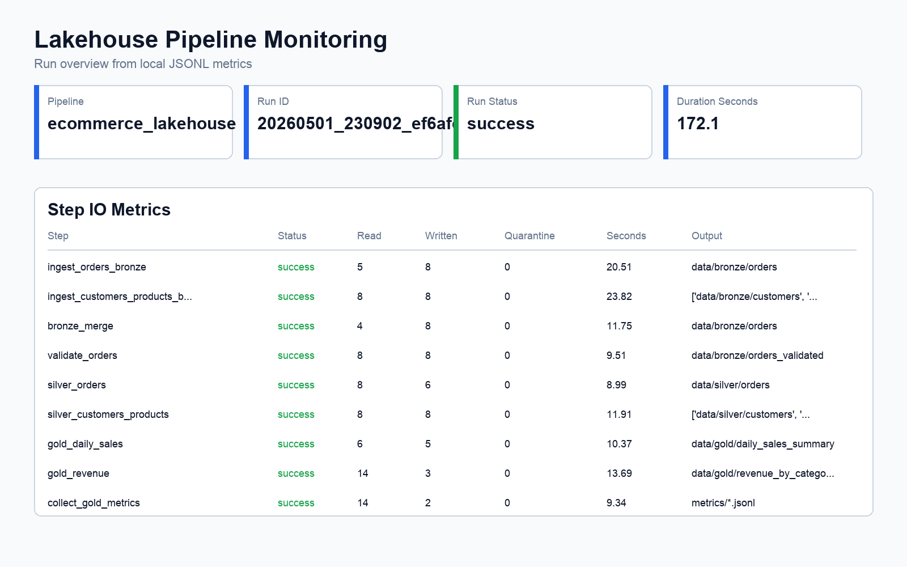
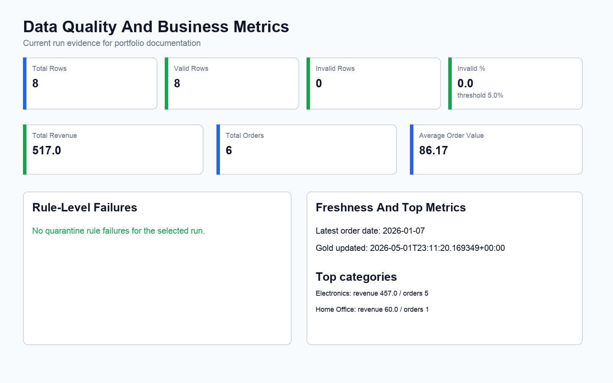
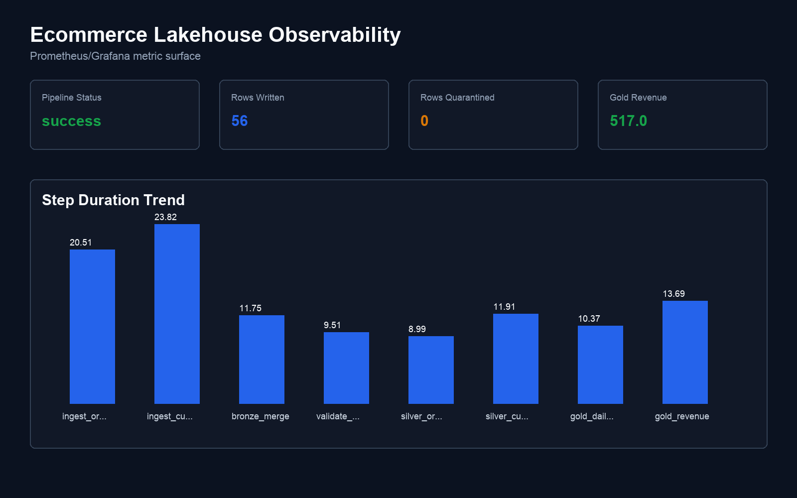

# Production Readiness

This page summarizes the current readiness posture, dashboard evidence,
limitations, and future work. The broader service expectations are captured in
`docs/production_readiness_plan.md`.

## Current Readiness

| Capability | Status | Evidence |
| --- | --- | --- |
| Layered lakehouse | Implemented | Bronze, quarantine, silver, and gold Delta paths are configured in `configs/*.yaml`. |
| Idempotent order upserts | Implemented | `src/delta_utils.py` merges by `order_id`, `source_update_ts`, and `record_hash`. |
| Slowly changing dimensions | Implemented | Customer and product silver tables use SCD Type 2 metadata with `is_current`, `valid_from`, and `valid_to`. |
| Pipeline orchestration | Implemented | `run_pipeline.py` validates config, executes dependencies, retries steps, supports selected-step backfills, and emits metrics. |
| Dagster orchestration surface | Implemented | Assets, retries, and schedule definitions live in `orchestration/`. |
| Data quality quarantine | Implemented | Invalid orders are separated into `orders_quarantine` with reason fields. |
| Contract tests | Implemented | Raw and gold schemas are tested in `tests/test_contract_table_schemas.py`. |
| Observability metrics | Implemented | JSONL metrics, Streamlit dashboard, Prometheus exporter, and Grafana dashboard are present. |
| Alerting rules | Implemented locally | Prometheus alert rules cover failed runs, stale gold freshness, high invalid percentage, missing metrics, and exporter scrape failure. |
| Alert routing | Implemented locally | Alertmanager is wired into Compose with a local UI receiver; external notification receivers are future work. |
| Security hygiene | Implemented locally | `.env`, generated data, metrics, and logs are excluded from Git; secret scanning targets exist. |
| CI quality checks | Implemented | `.github/workflows/ci.yml` runs Ruff, Black, pytest, and pipeline config validation on pull requests and pushes. |
| Production secrets | Not productionized | Local `.env` and Compose defaults need replacement with a managed secret store. |
| CD/deployment automation | Not present | Promotion, deployment, and production secret scanning are still manual or future work. |

## Dashboard Screenshots

Dashboard assets live in `docs/assets/`. The current assets are static
documentation screenshots generated from the local JSONL metrics files so the
repository can show the expected monitoring surfaces without committing runtime
data.







| Screenshot | Purpose |
| --- | --- |
| `docs/assets/dashboard_run_overview.png` | Latest run status, duration, step summary, and failure surface. |
| `docs/assets/dashboard_quality_business.png` | Data quality, freshness, and business metric panels. |
| `docs/assets/grafana_observability.png` | Prometheus/Grafana view of exported lakehouse metrics. |

Refresh screenshots after running:

```bash
make pipeline
make dashboard
```

Then open `http://localhost:8501`, capture the dashboard panels, and save them
under `docs/assets/`. For Grafana, run:

```bash
make observability
```

Then open `http://localhost:3000` and capture the `Ecommerce Lakehouse
Observability` dashboard.

## Operational SLO Targets

| Target | Initial value |
| --- | --- |
| Pipeline cadence | Daily batch |
| Gold freshness | Within 2 hours of pipeline start |
| Monitoring availability | Within 15 minutes of pipeline completion |
| Invalid row threshold | 5 percent by default |
| Failed run definition | Any required enabled step fails after retries or a dependency is missing |

## Known Limitations

- The project uses synthetic local seed data, not a live source system.
- CI quality checks exist for linting, formatting, tests, and config validation,
  but deployment automation and CI secret scanning are not implemented yet.
- Secrets are modeled with `.env` and environment variables, not a managed
  secret service.
- Referential validation is implemented using bronze customer and product
  reference tables; production deployments still need a formal policy for
  reference-data refresh cadence, versioning, and auditability.
- Gold tables use partition-aware overwrites by `order_date`; production
  deployments still need formal retention policy.
- Dashboard screenshots require a manual refresh workflow.
- Access control, audit policy, retention policy, and backup/restore procedures
  are not fully implemented.

## Future Work

1. Extend CI/CD with automated secret scanning, artifact publishing, and
   deployment or promotion workflows.
2. Add stronger reference-data governance for customer and product IDs, including
   refresh cadence, versioned snapshots, and audit reporting for lookup changes.
3. Add managed secrets for MinIO or cloud object storage credentials.
4. Add incremental gold rebuilds or partition-aware overwrite for larger data.
5. Add data retention and vacuum policy for Delta tables and quarantine.
6. Add automated dashboard screenshot generation in CI or a release script.
7. Connect Alertmanager to an external receiver such as Slack, email, PagerDuty,
   a webhook, or a cloud monitoring service.
8. Add richer backfill audit reports and operator approval records for unusual
   late-arriving data corrections.
9. Add a production deployment guide for cloud object storage and a managed
    orchestration service.
